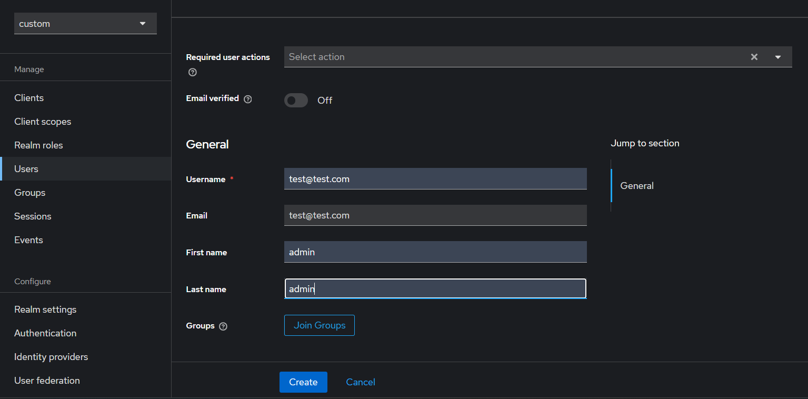

# Интеграция OIDC (Keycloack + Auth0) авторизации в Squidex


Keycloack реализует два стандарта протокала аутентификации:

- OpenID Connenct (OIDC)
- Security Assertion Markup Language 2.0 (SAML 2.0)

Squidex же может быть интегрирован с внешними поставщиками аутентификации (Microsoft, Google). Но также, в качестве поставщика можно указать свой, кастомный OIDC провайдер. 

Было реализовано два способа:
- OIDC, настроенный через внешний Auth0 провайдер 
- через свой OIDC провайдер Keyсloack (Docker) 

## Auth0 провайдер

### Запуск
Чтобы запустить эту реализацию нужно выполнить команды:

```bash
cd auth0
docker compose up
```

Перходим на `http://localhost` и кликаем на кнопку "Login to Squidex"


И выбираем "Login with OIDC"


Далее нас попросят ввести логин и пароль. 


Вводим следующие данные:

```
Логин: test@test.com
Пароль: 9wJ6EJ4PT@n#efF
```

Нажимаем _Continue_

Пользователь успешно аутентифицирован! 


## Конфигурация

Конфигурация, связанная с настройкой OIDC, находитя в docker-compose.yml. А именно:

```yml
- IDENTITY__OIDCNAME=OIDC
- IDENTITY__OIDCAUTHORITY=https://dev-gl5uck3rwsnmtx8d.us.auth0.com/                    # Ссылка на authority
- IDENTITY__OIDCCLIENT=joG6FKco28bHV4cX70janXIdcX2eySSm                                 # clientID
- IDENTITY__OIDCSECRET=HJhAAjTpTD75FcUiEarEDYKf4-f10iCxNIJQOICzo6IsQWUS9ogUJGcJxd-lqU1m # clientSecret
- IDENTITY__OIDCSCOPES__0=openid                                                        # Указываем нужные scopes
- IDENTITY__OIDCSCOPES__1=email                                                         # Указываем нужные scopes
- IDENTITY__OIDCRESPONSETYPE=code                                                       # Code grant
```

## Keycloack провайдер

## Запуск 

Чтобы запустить эту реализацию нужно выполнить команды:

```bash
cd keycloack
docker compose up
```

Но этого не достаточно, нужно предварительно настроить Keycloack и сконфигурировать Squidex. 

### Настройка Keycloack

После запуска контейнеров переходим по адресу `http://localhost:5489/`

Здесь вводим логин/пароль администратора. По умолчанию admin/admin соответсвенно. 


Далее нужно создать realm. Кликаем по _master_ > _Create realm_. Вводим название, например custom и нажимаем кнопку _Create_


Нажимаем на _clients_ > _Create client_. Здесь вводим идентификатор клиента, н-р custom-id


На втором шаге ничего не меняем 


На третьем шаге заполняем поля как на фото ниже.


Нажимаем _Save_.

Далее переходим на вкладку Users и нажимаем кнопку _Create New User_. Заполняем все поля и нажимаем _Create_



У созданного пользователя нужно задать пароль. Для этого переходим на вкладку _Credentials_ и нажимаем на кнопку _Set Password_


Заполняем пароль и сохраняем. Можно убрать флаг _Temporary_, тогда введенный пароль не будет временным.

Далее останавливаем контейнер и переходим к конфигурации Squidex.

### Конфигурация Squidex

Нужно изменить перменные на указанные в Keycloack значения. 

```yml
- IDENTITY__OIDCAUTHORITY=http://custom.local:5489/realms/custom # в конце название созданного realm
- IDENTITY__OIDCCLIENT=custom-id # id клиента
- IDENTITY__OIDCSECRET=
- IDENTITY__OIDCSCOPES__0=openid
- IDENTITY__OIDCSCOPES__1=email
- IDENTITY__OIDCRESPONSETYPE=code
```

Можно заметить, что путь к провайдеру (IDENTITY__OIDCAUTHORITY) имеет странный домен (custom.local). Чтобы все работало нужно этот домен указать hosts. 

Переходим в папку `C:\Windows\System32\drivers\etc` и изменяем файл hosts. Нужно добавить в самый низ строку:

```
127.0.0.1 custom.local
```

Сохраняем файл. В качетсве домена можно указать любой другой, тогда нужно изменить соответсвующие значения в yml файле. 

Манипуляции с hosts нужны из-за локального развертывания провайдера авторизации и Squidex. Это не позволяет в ссылках указать просто localhost. Но в проиводственной среде данная проблема не возникает, так как обычно имеется общий домен или провайдер авторизации находится на другом сервере. Более подробно: https://docs.squidex.io/id-01-getting-started/installation/platforms/install-on-docker

Далее запускаем контейнеры и переходим по ссылке `http://localhost`. Нажимаем _Login to Squidex_ и _Login with OIDC_

Нас встретит окно авторизации. В нем заполяем данные ранее созданного пользователя и нажимаем _Sign In_. 


Принимаем все соглашения и нажимаем _I Agree!_


Вы авторизованы!

